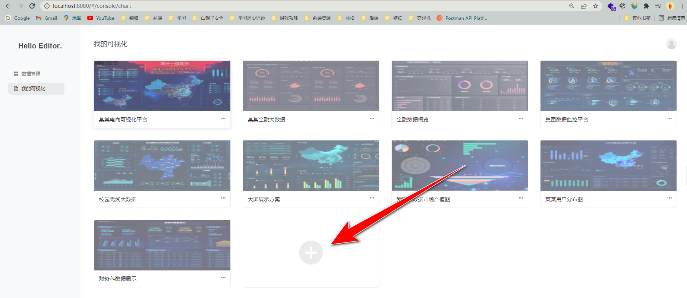
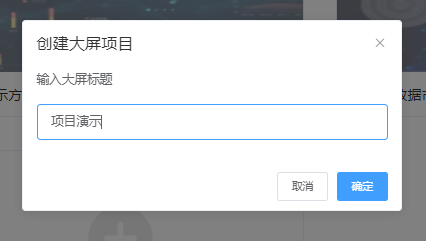
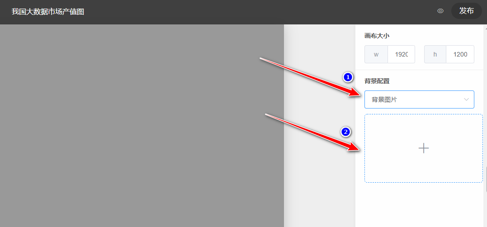
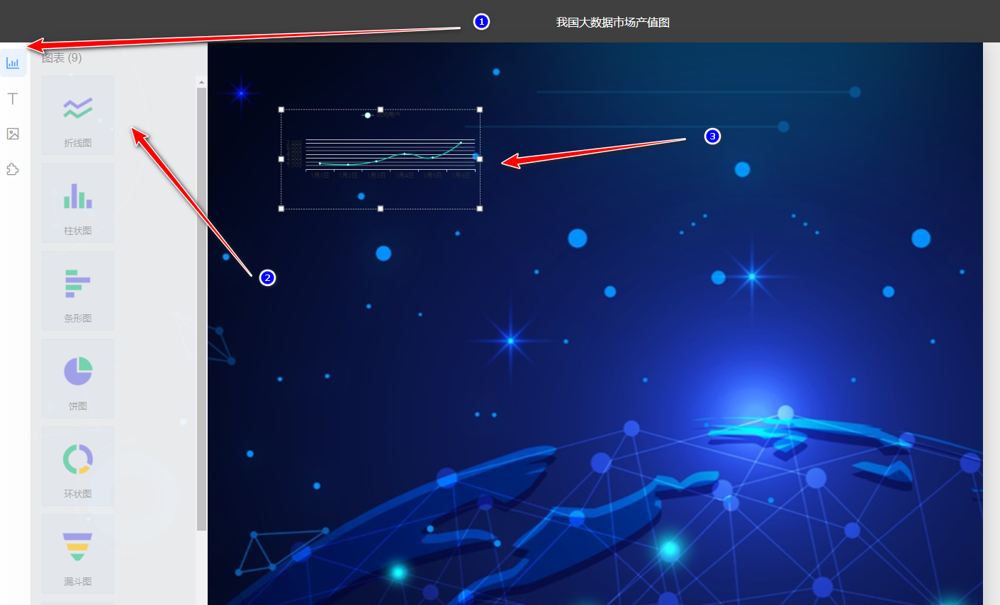
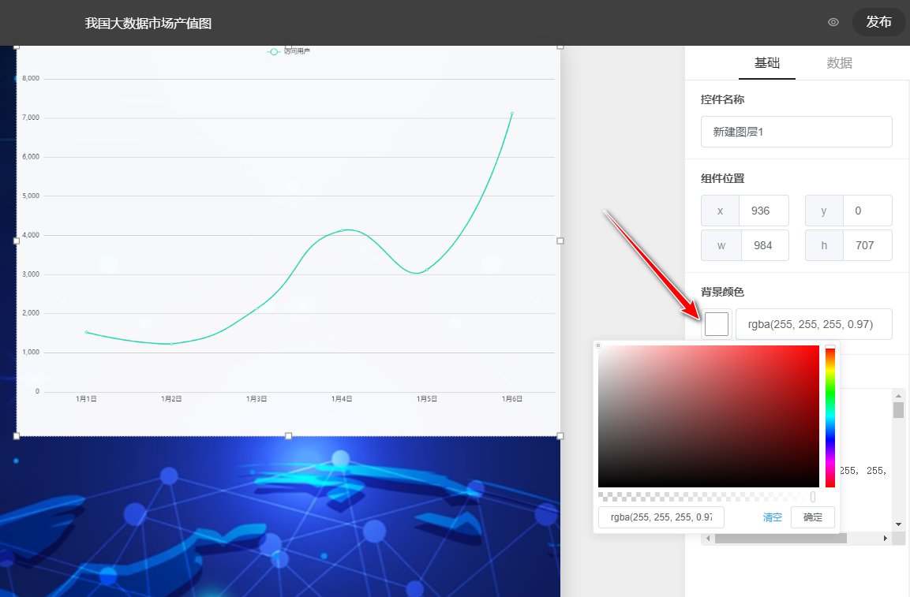
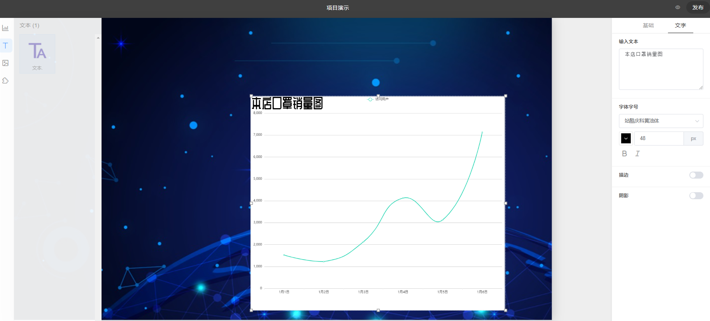
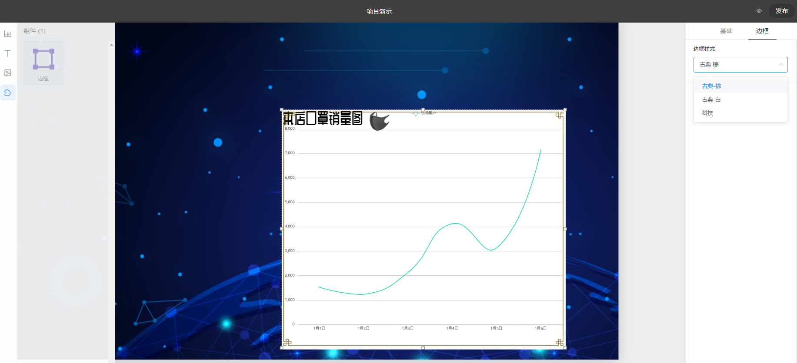
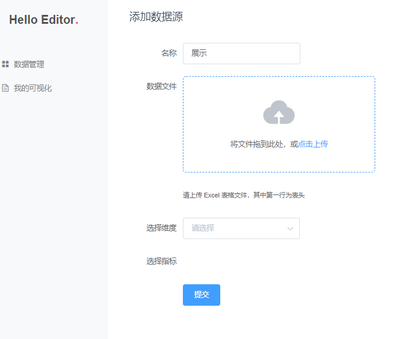
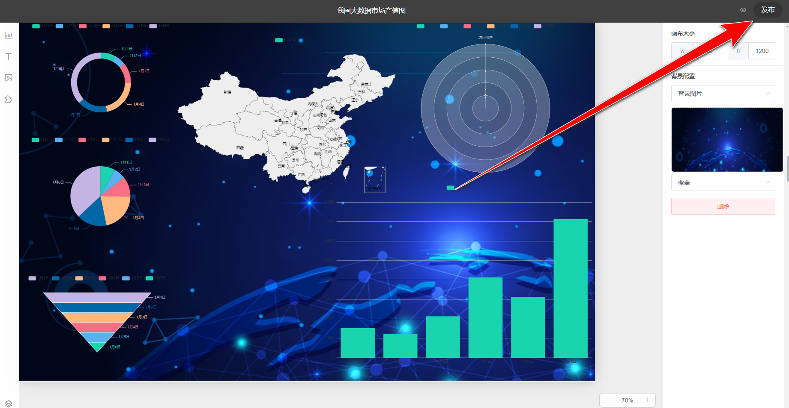
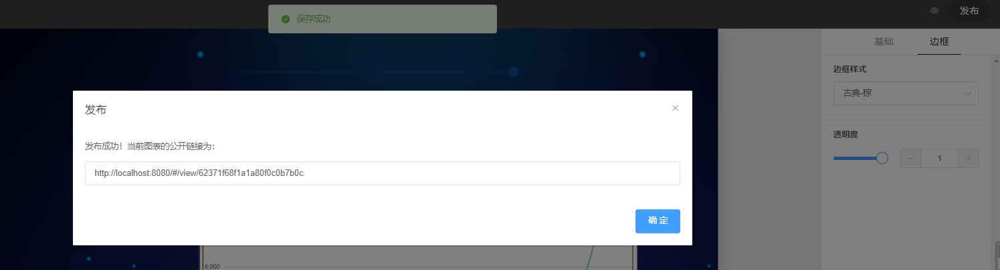

# 可编辑大屏幕的数据可视化
大屏幕的数据可视化。以大屏幕为主要显示载体的可视化仪表盘设计被称为大屏幕的数据可视化。它的特点是面积大，动态效果酷，色彩丰富。大屏幕仪表盘可用于信息显示、数据分析、监测和预警。

# Large-screen-visualization
Data visualization for large screen.The visual dashboard design with large screen as the main display carrier is called data visualization for large screen. It features large areas, cool dynamic effects and rich colors. The dashboard for large screen can be used for information display, data analysis, monitoring and early warning.

## 主要功能使用说明

🎈登录注册注销等操作不予展示，请自行体验

### 新建大屏项目





点击确定进入大屏编辑界面

### 编辑大屏


屏幕左方是图层控制区，中间是展示区域，右侧是详细设置




右侧可以选择项目背景图片进行上传



左侧选择需要展示的图表类型，点选当前图层，可以设置透明度





左侧可编辑文本


上传图片



为图表添加边框

### 数据源

数据管理列可新增数据源


点击新增数据源可添加excel表格等数据



### 保存发布



### 分享

复制网页URL即可让所有人查看




# 前端部分

> A Vue.js project

## Build Setup

``` bash
# install dependencies
npm install

# serve with hot reload at localhost:8080
npm run serve

# build for production with minification
npm run build

# build for production and view the bundle analyzer report
npm run build --report

# run unit tests
npm run unit

# run e2e tests
npm run e2e

# run all tests
npm test
```

For a detailed explanation on how things work, check out the [guide](http://vuejs-templates.github.io/webpack/) and [docs for vue-loader](http://vuejs.github.io/vue-loader).

# 后端部分：Node.js + Koa + MongoDB

准备工作：配置并运行 MongoDB 数据库，新建一个空数据库并命名为chartfun。无需手动配置表结构，它们会被自动创建。

## Run web-service
```bash
cd ./server
# install
npm install
# then 
node app.js
# if you have nodemon please use
nodemon app.js
```
